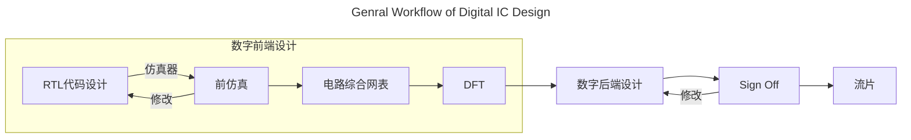
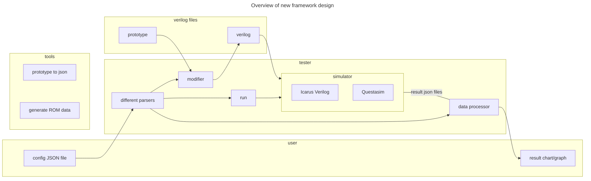
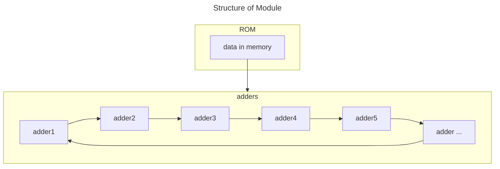
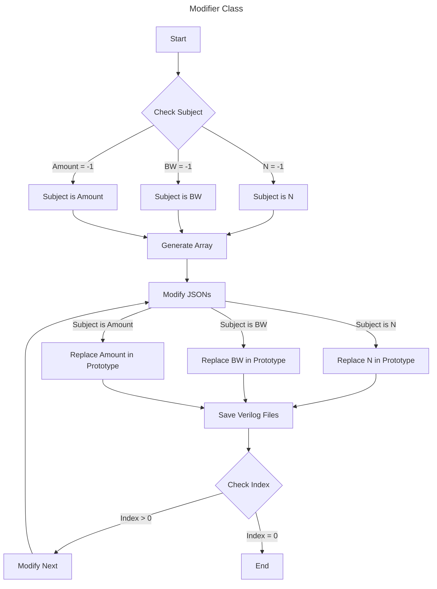
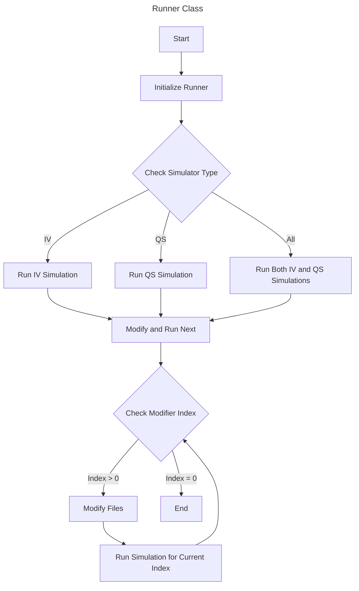
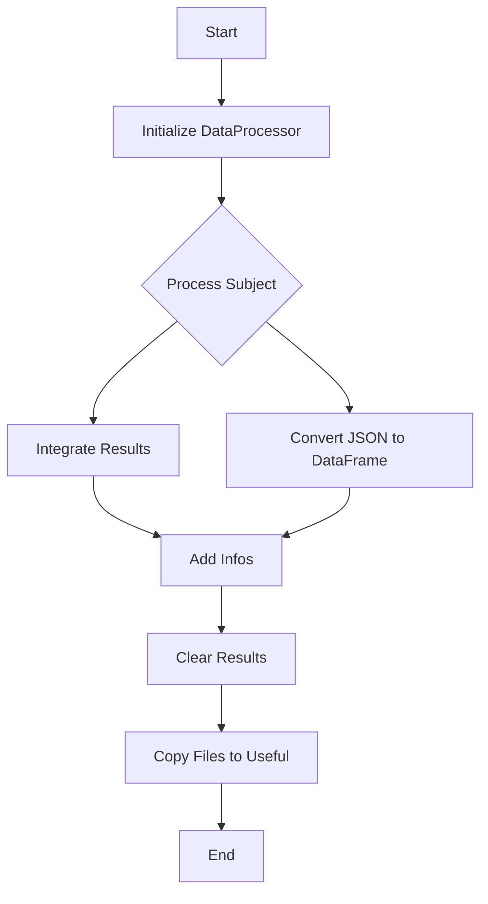
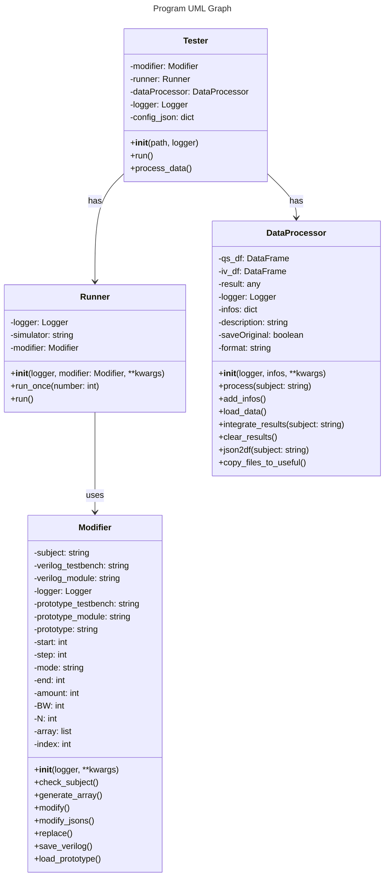
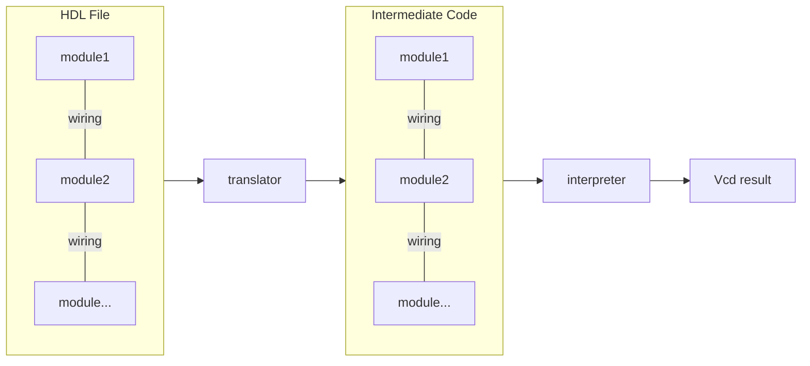
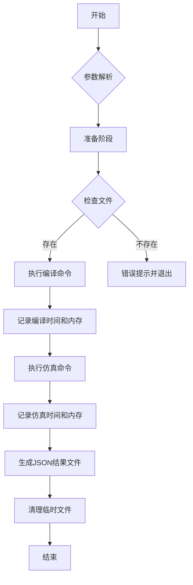

```mermaid
---
title: Genral Workflow of Digital IC Design
---
flowchart LR

subgraph 数字前端设计
   RTL[RTL代码设计] --仿真器-->
   frontSimu[前仿真] --修改-->
   RTL
   frontSimu --> sysn[电路综合网表]
   --> DFT[DFT]
end

DFT--> BE[数字后端设计]
--> SO[Sign Off]
--修改--> BE
SO --> TO[流片]
```

```mermaid
---
title: Overview of new framework design 
---
flowchart LR 
    
    subgraph user
        cf[config JSON file]
        result[result chart/graph]
    end
    
    
    subgraph tools 
        gv[prototype to json] ~~~
        gr[generate ROM data]
    end
    
    subgraph tester
        subgraph simulator
            iv[Icarus Verilog]
            qs[Questasim]
        end
        

        dp[different parsers]
        dp --> modifier
        dp --> run
        dp --> data[data processor]
    end

    subgraph verilog files
        prototype --> modifier
        modifier --> verilog
    end

    verilog--> simulator
    run --> simulator
    simulator --result json files--- data
    
    cf --> dp
    data --> result
```

```mermaid
---
title: Structure of Module
---
flowchart TB
    subgraph adders
        direction LR
        adder1 -->
        adder2 -->
        adder3 -->
        adder4 -->
        adder5 -->
        adderx[adder ...]-->
        adder1
    end
    
    subgraph ROM 
        m[data in memory]
    end
    
    m--> adders
```

```mermaid
---
title: Modifier Class
---
flowchart TD
    A[Start] --> B{Check Subject}
    B -->|N = -1| C[Subject is N]
    B -->|BW = -1| D[Subject is BW]
    B -->|Amount = -1| E[Subject is Amount]
    C --> F[Generate Array]
    D --> F
    E --> F
    F --> G[Modify JSONs]
    G -->|Subject is N| H[Replace N in Prototype]
    G -->|Subject is BW| I[Replace BW in Prototype]
    G -->|Subject is Amount| J[Replace Amount in Prototype]
    H --> K[Save Verilog Files]
    I --> K
    J --> K
    K --> L{Check Index}
    L -->|Index > 0| M[Modify Next]
    L -->|Index = 0| N[End]
    M --> G
```

```mermaid
---
title: Runner Class
---
flowchart TD
    A[Start] --> B[Initialize Runner]
    B --> C{Check Simulator Type}
    C -->|IV| D[Run IV Simulation]
    C -->|QS| E[Run QS Simulation]
    C -->|All| F[Run Both IV and QS Simulations]
    D --> G[Modify and Run Next]
    E --> G
    F --> G
    G --> H{Check Modifier Index}
    H -->|Index > 0| I[Modify Files]
    I --> J[Run Simulation for Current Index]
    J --> H
    H -->|Index = 0| K[End]
```

```mermaid
flowchart TD
    A[Start] --> B[Initialize DataProcessor]
    B --> C{Process Subject}
    C --> D[Integrate Results]
    C --> E[Convert JSON to DataFrame]
    D --> G[Add Infos]
    E --> G
    G --> H[Clear Results]
    H --> I[Copy Files to Useful]
    I --> J[End]
```

```mermaid
---
title: Program UML Graph
---
classDiagram 
    class Tester {
        -modifier: Modifier
        -runner: Runner
        -dataProcessor: DataProcessor
        -logger: Logger
        -config_json: dict
        +__init__(path, logger)
        +run()
        +process_data()
    }
    class Modifier {
        -subject: string
        -verilog_testbench: string
        -verilog_module: string
        -logger: Logger
        -prototype_testbench: string
        -prototype_module: string
        -prototype: string
        -start: int
        -step: int
        -mode: string
        -end: int
        -amount: int
        -BW: int
        -N: int
        -array: list
        -index: int
        +__init__(logger, **kwargs)
        +check_subject()
        +generate_array()
        +modify()
        +modify_jsons()
        +replace()
        +save_verilog()
        +load_prototype()
    }
    class Runner {
        -logger: Logger
        -simulator: string
        -modifier: Modifier
        +__init__(logger, modifier: Modifier, **kwargs)
        +run_once(number: int)
        +run()
    }
    class DataProcessor {
        -qs_df: DataFrame
        -iv_df: DataFrame
        -result: any
        -logger: Logger
        -infos: dict
        -description: string
        -saveOriginal: boolean
        -format: string
        +__init__(logger, infos, **kwargs)
        +process(subject: string)
        +add_infos()
        +load_data()
        +integrate_results(subject: string)
        +clear_results()
        +json2df(subject: string)
        +copy_files_to_useful()
    }

    Tester --> Runner : has
    Tester --> DataProcessor : has
    Runner --> Modifier : uses
    
```

```mermaid
flowchart LR 
    subgraph HDL[HDL File]
        module1 --wiring---
        module2 --wiring---
        module[module...]
    end
    subgraph IC[Intermediate Code]
        block1[module1] --wiring---
        block2[module2] --wiring---
        block3[module...]
    end
    
    HDL --> translator
    translator --> IC
    
    IC --> interpreter
    --> result[Vcd result]
```

```mermaid
graph TD;
    A[开始] --> B{参数解析};
    B --> C[准备阶段];
    C --> D{检查文件};
    D -->|存在| E[执行编译命令];
    D -->|不存在| F[错误提示并退出];
    E --> G[记录编译时间和内存];
    G --> H[执行仿真命令];
    H --> I[记录仿真时间和内存];
    I --> J[生成JSON结果文件];
    J --> K[清理临时文件];
    K --> L[结束];
```