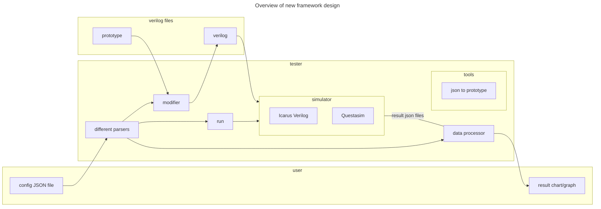
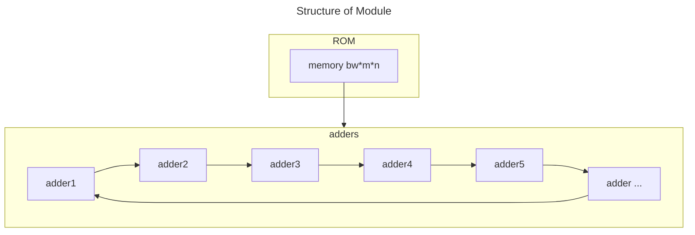

## New structure and new features

folder structure:
- docs
- inputs
  - prototype
  - conf JSON
- outputs
  - result 
  - temp
  - log
- source
  - \*.py
  - \*.sh
- \*JustTest
- main.py (as the entrance)

Highlight:
- Utilize a single JSON file for configuring the entire experiment setup, with the capability to include
results with in the same file.
- Integrate a dedicated package for data processing and visualization, offering tailored presentation 
of results.
- Enhanced debugging convenience through an integrated logging system.
- Greater flexibility for user to customize their experimental setup.
- Streamlined and coherent project structure.

## New ideas

When trying to generate modules automatically, there are some difficulties following:
1. High-bit-width testing is necessary, but verilog just can give 32bits random number. There must be a python program to
generate values and verilog testbench read them.
2. It Should reduce the frequency of getting data from a file to initial or input a register or port, because it does 
not indicate the performance of simulators. However, it is challenging to generate a module network to just initialize 
once and at the same time ensure generate correct high bit-width value.
3. Time is short, and it is better if it can support more testing subjects.

To solute them, there is a new design pattern: build a synthetic module including ROM and adders. Adders get the a and b
value to compute. It just read once file at the beginning of the testbench. It also tests the memory simulating 
performance. Besides, it is more practical because it is more likely with real processors. 

This novel method also provides more scalability. Users can choose different way to connect adders.

