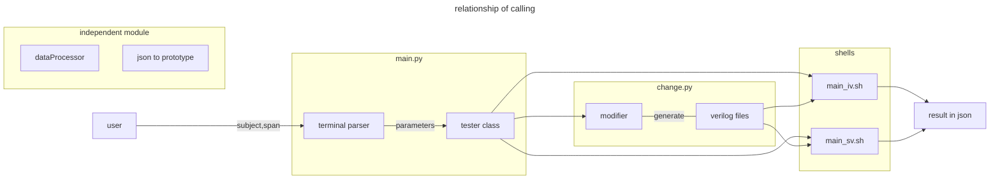

The first and foremost thing is to sort out the previous 
ideas and structures of the whole platform. After that, I can design
a novel one and find the things I should do specifically.

### Original framework

Macroscopic flowchart:

Shortage analyse:
- Needless files: For example, the change.py seem unnecessary to be a solo python file, and its function 
can be integrated in tester class.
- Function not used: There are some functions and class have been set in dataProcess.py, but this section have a 
bad connection to the main part of the project.
- Insufficient autonomization: User must set many parameters manually, and even that it have some important could not 
be set personalize, which may cause remarkable influence on performance.

### Specific module design

##### About verilog files

What is the detailed process of generating verilog file?

ToDo:
- In Icarus Verilog, you can put the prototype module in the testbench file. However, you will encounter some wrong in 
Questasim if you choose the same style. So, the best solution is to save this two part respectively. 